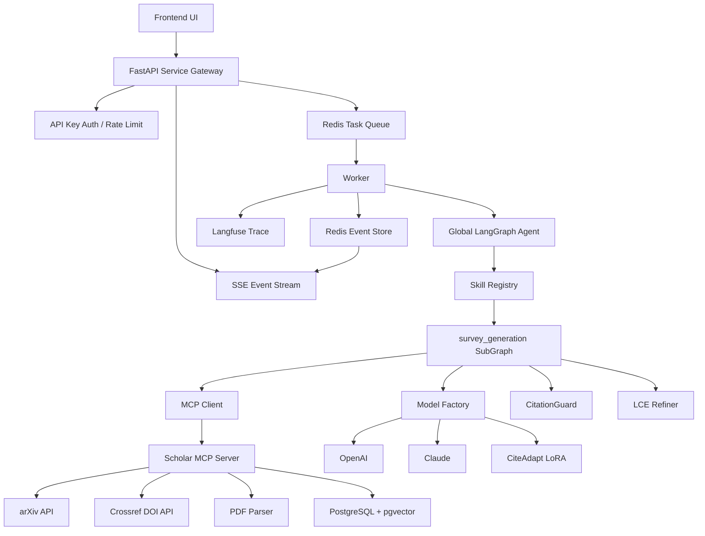

# ScholarAgent 产品化架构与实现规范

## 0. 文档定位

本文档是 ScholarAgent 后续完整实现的唯一产品化规格说明。后续编码、重构、测试、部署都应以本文档为准。

本文档基于当前项目中的历史对话、启动说明、Skill 说明和现有代码雏形整理而成，目标是把“学术综述 Agent 的想法”落成一个可运行、可扩展、可演示、可面试讲解的完整项目。

## 1. 产品定位

ScholarAgent 是一个面向科研综述写作的多阶段 Agent 系统。它解决的核心问题是：

1. 用户输入 PDF、arXiv ID 或 DOI 后，系统自动完成论文采集、解析、入库和文献池构建。
2. 系统基于 LangGraph 执行“采集 -> 大纲 -> 人工确认 -> 章节写作 -> 质量反思 -> 引用校验 -> CiteAdapt 格式化 -> 终稿交付”的闭环流程。
3. 系统通过 MCP 数据中枢统一管理外部数据源和个人知识库，避免业务 Agent 直接耦合数据库、arXiv、Crossref、PDF 解析器。
4. 系统通过引用 ID 绑定、交叉校验和条件边重写，最大限度降低虚构引用。
5. 系统通过 API Key、会话隔离、限流、任务队列、SSE、Langfuse 追踪和 Docker Compose，具备服务化能力。

一句话定位：

> ScholarAgent 是一个基于 LangGraph + MCP + Skill 子图的学术综述生成系统，重点体现多源文献采集、渐进式披露、引用防幻觉、反思重写、CiteAdapt 引用格式化和全链路服务化。

## 2. 核心设计原则

1. 主 Agent 只做调度，不塞业务细节。
   `agents/graph.py` 负责任务路由、全局状态和跨 Skill 编排；综述生成的复杂逻辑放进 `skills/survey_generation/main_workflow.py`。

2. Skill 是可插拔业务单元。
   每个 Skill 必须包含 `SKILL.md`、`main_workflow.py`、`prompts/`、`tools/`，并暴露统一 `build_graph()` 或 `run()` 入口。

3. MCP 是数据中枢，不是简单工具脚本。
   MCP 服务负责 PDF/arXiv/DOI 采集、个人知识库、工具注册表、安全分级、分页响应和引用审计。

4. 大模型负责理解和写作，确定性工具负责边界和校验。
   分块、引用 ID 校验、引用格式化、任务限流、安全拦截必须用代码和专用模型完成，不能只靠 Prompt。

5. 所有长任务必须异步化。
   API 创建任务后立即返回 `task_id`，后台 Worker 执行 LangGraph，前端通过 SSE 订阅进度。

6. 所有用户数据必须带 `user_id`。
   API、任务、知识库、偏好、文献池、会话状态都必须按用户隔离。

## 3. 目标用户与典型流程

### 3.1 目标用户

1. 研究生、科研实习生、论文阅读者。
2. 需要快速整理某个方向文献综述的人。
3. 需要展示 Agent 工程化能力的项目面试场景。

### 3.2 标准用户流程

1. 用户输入研究主题，并选择输入来源：PDF、arXiv ID、DOI。
2. 前端上传文件或提交 ID，后端创建任务。
3. 后端返回 `task_id`，前端打开 SSE 连接。
4. 后台 Worker 调用 MCP 完成文献采集和标准化。
5. Agent 生成文献池摘要和全局大纲。
6. 前端展示大纲，等待用户确认或修改。
7. 用户确认后，系统先试写一个章节并展示引用校验报告。
8. 校验通过后，系统并行或分批生成全篇章节。
9. Reviewer 检测引用、逻辑、重复、结构完整性。
10. 不合格时触发 Critic 和 Rewrite，最多重试 3 次。
11. 引用通过后调用 CiteAdapt LoRA 进行 IEEE、APA 或 GB/T 7714 格式化。
12. LCE Refiner 合并章节，生成终稿 Markdown。
13. 前端展示终稿、引用审计报告、生成日志和可下载结果。

## 4. 产品能力清单

### 4.1 多源输入与异步生成

必须支持三种输入：

1. PDF：用户上传本地 PDF，系统解析标题、作者、摘要、正文、参考文献。目标解析耗时 3-5 秒，复杂 PDF 可降级为 10-20 秒并返回解析质量提示。
2. arXiv：用户输入 arXiv ID 或关键词，MCP 调用 arXiv API 获取元数据和摘要，必要时下载 PDF。
3. DOI：用户输入 DOI，MCP 调用 Crossref 获取 CSL 元数据，必要时根据 URL 或开放资源补充摘要。

长任务必须通过后台队列执行，避免 HTTP 请求阻塞。前端只通过 SSE 监听进度。

### 4.2 渐进式披露

系统不能一次性从输入直接生成终稿。必须拆成可观察、可干预的阶段：

1. 数据评估：展示已采集文献数量、来源和解析质量。
2. 大纲预览：展示合成大纲，等待用户确认。
3. 章节试写：只写第一个核心章节，展示引用校验结果。
4. 全篇生成：通过后才继续生成全部章节。
5. 引用审计：展示每个引用 ID 是否来自当前文献池。
6. 最终交付：展示正文、参考文献、日志和质量评分。

### 4.3 可插拔 Skill 子图

`survey_generation` 不是主 Agent 的一段长 Prompt，而是一个独立 LangGraph 子图。主 Agent 通过注册表加载它。

每个 Skill 必须提供：

1. `SKILL.md`：能力说明、阶段、输入输出、验收标准。
2. `main_workflow.py`：Skill 子图。
3. `state.py`：Skill 内部状态。
4. `prompts/`：写作、反思、评估 Prompt。
5. `tools/`：分块、合成、引用校验、格式化、LCE 等确定性工具。

### 4.4 评估反思与自动重写

系统必须实现双层评估：

1. Skill 内部评估：章节级引用校验、内容完整度、章节相关性。
2. 全局评估：全文结构、章节重复、逻辑冲突、引用覆盖率、格式合规性。

反思失败时，系统必须记录 `reflection_logs`，并通过 LangGraph 条件边回到 `rewrite` 节点。重写必须是局部重写，不允许每次都重跑全部流程。

### 4.5 引用绑定与防幻觉

写作节点必须强制使用当前任务文献池中的来源 ID，例如 `[paper:arxiv_2301_00001]`。

生成后必须调用 `CitationGuard`：

1. 提取正文中的所有引用 ID。
2. 与 `active_paper_pool` 求交。
3. 找出不存在的 ID。
4. 输出审计报告。
5. 若发现虚构引用，触发 Rewrite。

验收要求：最终交付版本中虚构引用数量必须为 0。

### 4.6 CiteAdapt 引用格式化

CiteAdapt 是 Qwen-1.5B LoRA 微调模型，只负责引用格式标准化。它不能替代主写作模型。

放置位置：

1. 在 `CitationGuard` 之后。
2. 在 `LCE Refiner` 之前。
3. 作为 `skills/survey_generation/tools/formatter.py` 中的 `CitationFormatter` 调用。

输入为已校验的文献元数据和目标风格。输出为标准参考文献列表，以及正文中的引用替换结果。

### 4.7 大纲修改后的局部续写

系统必须支持用户修改大纲后只重写受影响章节。

实现方式：

1. 保存 `outline_version`。
2. 对比新旧大纲，标记 `dirty_sections`。
3. 写作节点只处理脏章节。
4. 重写时注入前后章节作为上下文。
5. 保留未修改章节和已通过的引用校验结果。

### 4.8 个人知识库与安全分级

系统必须支持基于多用户隔离的个人知识库：

1. 保存论文元数据、摘要、正文片段、向量、标签、用户偏好。
2. 支持自然语言增删改查，主 Agent 解析意图后调用 MCP 工具。
3. 所有查询必须强制注入 `user_id`。

工具安全分为三级：

1. LOW：只读查询，如搜索论文、读取最近文献。
2. MEDIUM：写入或更新，如保存论文、更新标签、记录偏好。
3. HIGH：删除、批量修改、清空知识库等危险操作。

HIGH 工具必须返回 `REQUIRE_CONFIRM`，等待前端人工确认后才能执行。

### 4.9 全链路服务化

必须包含：

1. API Key 认证：所有 API 请求携带 `X-API-Key`。
2. 会话隔离：任务使用 `task_id` 和 LangGraph `thread_id` 隔离状态。
3. Redis：限流、任务状态、SSE 事件队列、缓存。
4. PostgreSQL + pgvector：个人知识库和向量检索。
5. Langfuse：记录模型调用、节点耗时、Token、错误。
6. 模型工厂：支持 OpenAI、Claude 和本地 CiteAdapt。
7. Failover：主模型失败时切换备选模型。
8. Docker Compose：一键启动后端、Worker、MCP、Redis、Postgres、前端。

## 5. 总体架构



## 6. 目标目录结构

后续实现应把项目整理为以下结构：

```text
ScholarAgent/
├── app/
│   ├── __init__.py
│   ├── main.py
│   ├── dependencies.py
│   ├── schemas.py
│   ├── routes/
│   │   ├── tasks.py
│   │   ├── knowledge.py
│   │   └── health.py
│   ├── services/
│   │   ├── task_service.py
│   │   ├── auth_service.py
│   │   ├── rate_limit.py
│   │   └── sse.py
│   └── workers/
│       ├── runner.py
│       └── queue.py
├── agents/
│   ├── __init__.py
│   ├── graph.py
│   ├── state.py
│   ├── factory.py
│   ├── evaluator.py
│   ├── skill_registry.py
│   └── prompts/
│       ├── router.py
│       └── final_review.py
├── skills/
│   └── survey_generation/
│       ├── SKILL.md
│       ├── __init__.py
│       ├── main_workflow.py
│       ├── state.py
│       ├── config.yaml
│       ├── prompts/
│       │   ├── outline.py
│       │   ├── writing.py
│       │   ├── critic.py
│       │   └── evaluator.py
│       └── tools/
│           ├── __init__.py
│           ├── processor.py
│           ├── synthesizer.py
│           ├── citation.py
│           ├── formatter.py
│           ├── evaluator_tool.py
│           └── refiner.py
├── mcp_server/
│   ├── pyproject.toml
│   └── src/
│       └── scholar_mcp/
│           ├── __init__.py
│           ├── main.py
│           ├── stdio_server.py
│           ├── http_server.py
│           ├── common.py
│           ├── decorators.py
│           ├── safety.py
│           ├── resources.py
│           ├── tools/
│           │   ├── __init__.py
│           │   ├── meta_tools.py
│           │   ├── registry.py
│           │   ├── ingestion.py
│           │   ├── search.py
│           │   ├── knowledge.py
│           │   ├── citation.py
│           │   └── preference.py
│           ├── handlers/
│           │   ├── arxiv.py
│           │   ├── doi.py
│           │   ├── pdf.py
│           │   └── embeddings.py
│           └── db/
│               ├── session.py
│               ├── models.py
│               └── repository.py
├── models/
│   ├── README.md
│   ├── base_models/
│   └── lora_adapters/
│       └── cite_adapt/
├── frontend/
│   ├── index.html
│   └── assets/
├── deploy/
│   ├── Dockerfile.backend
│   ├── Dockerfile.worker
│   ├── Dockerfile.mcp
│   └── nginx.conf
├── tests/
│   ├── test_api_tasks.py
│   ├── test_citation_guard.py
│   ├── test_skill_workflow.py
│   ├── test_mcp_registry.py
│   └── test_rate_limit.py
├── docker-compose.yml
├── requirements.txt
├── .env.example
├── 启动说明.md
└── docs/product/PRODUCT_ARCHITECTURE.md
```

## 7. 后端 API 规范

### 7.1 认证

所有业务接口必须要求 Header：

```http
X-API-Key: <user-api-key>
```

API Key 映射到 `user_id`。开发环境可以使用 `.env` 中的静态映射，生产化结构应支持数据库表 `api_keys`。

### 7.2 创建综述任务

```http
POST /tasks/survey
Content-Type: application/json
X-API-Key: <key>
```

请求体：

```json
{
  "topic": "Large Language Models in Healthcare",
  "input_type": "arxiv",
  "input_value": "2301.00001",
  "citation_style": "IEEE",
  "max_papers": 30,
  "require_outline_confirmation": true
}
```

`input_type` 可选值：

1. `pdf`
2. `arxiv`
3. `doi`

响应：

```json
{
  "task_id": "uuid",
  "status": "queued",
  "stream_url": "/tasks/{task_id}/stream"
}
```

### 7.3 上传 PDF

```http
POST /tasks/survey/pdf
Content-Type: multipart/form-data
X-API-Key: <key>
```

字段：

1. `file`: PDF 文件。
2. `topic`: 可选，若为空则从 PDF 标题推断。
3. `citation_style`: 默认 `IEEE`。

服务端保存路径：

```text
storage/uploads/{user_id}/{task_id}/{filename}.pdf
```

### 7.4 SSE 任务流

```http
GET /tasks/{task_id}/stream
X-API-Key: <key>
```

事件格式：

```text
event: progress
data: {"task_id":"...","phase":"outline","message":"Outline generated","percent":25}

event: outline_required
data: {"outline_version":1,"outline":[...]}

event: citation_audit
data: {"valid":true,"hallucinations":[],"coverage":0.92}

event: completed
data: {"result_url":"/tasks/{task_id}/result"}
```

### 7.5 大纲确认与修改

```http
POST /tasks/{task_id}/outline
```

请求体：

```json
{
  "outline_version": 1,
  "action": "confirm",
  "outline": []
}
```

`action` 可选：

1. `confirm`
2. `revise`

当 `revise` 时，后端必须标记 `dirty_sections`，只重写受影响章节。

### 7.6 获取结果

```http
GET /tasks/{task_id}/result
```

响应：

```json
{
  "task_id": "uuid",
  "status": "completed",
  "markdown": "...",
  "references": [],
  "citation_audit": {},
  "reflection_logs": [],
  "trace_id": "langfuse-trace-id"
}
```

## 8. 后端数据模型

### 8.1 TaskRequest

```python
class TaskRequest(BaseModel):
    topic: str
    input_type: Literal["pdf", "arxiv", "doi"]
    input_value: str
    citation_style: Literal["IEEE", "APA", "GB/T 7714"] = "IEEE"
    max_papers: int = Field(default=30, ge=1, le=1500)
    require_outline_confirmation: bool = True
```

### 8.2 TaskState

```python
class TaskState(BaseModel):
    task_id: str
    user_id: str
    status: Literal["queued", "running", "waiting_user", "completed", "failed"]
    phase: str
    topic: str
    input_type: str
    input_value: str
    citation_style: str
    percent: int
    error: str | None = None
```

### 8.3 PaperRecord

```python
class PaperRecord(BaseModel):
    paper_id: str
    user_id: str
    source: Literal["pdf", "arxiv", "doi", "local"]
    title: str
    authors: list[str] = []
    abstract: str = ""
    full_text: str = ""
    published_at: str | None = None
    doi: str | None = None
    arxiv_id: str | None = None
    url: str | None = None
    metadata: dict = {}
```

### 8.4 CitationAudit

```python
class CitationAudit(BaseModel):
    is_valid: bool
    found_ids: list[str]
    hallucinated_ids: list[str]
    missing_reference_ids: list[str]
    coverage: float
    suggestions: dict[str, list[str]]
```

## 9. LangGraph 全局 Agent 规范

### 9.1 GlobalState

`agents/state.py` 必须定义：

```python
class GlobalState(TypedDict):
    task_id: str
    user_id: str
    session_id: str
    task_type: str
    topic: str
    input_type: str
    input_value: str
    citation_style: str
    active_skill: str
    skill_result: dict
    final_report: str
    reflection_logs: list[dict]
    status_updates: list[dict]
    error: str | None
```

### 9.2 全局节点

1. `route_task`：识别任务类型，当前固定为 `survey_generation`。
2. `load_skill`：读取 Skill 注册表和 `SKILL.md`。
3. `run_skill`：调用 Skill 子图。
4. `global_review`：全文终审。
5. `finalize`：生成最终输出。
6. `error_handler`：失败兜底，并写入任务状态。

### 9.3 全局条件边

1. `route_task -> run_skill`
2. `run_skill -> global_review`
3. `global_review -> finalize`，当评分通过。
4. `global_review -> run_skill`，当结构性缺陷可修复。
5. `global_review -> error_handler`，当超过重试次数。

## 10. Survey Skill 子图规范

### 10.1 SkillState

`skills/survey_generation/state.py` 必须定义：

```python
class SurveyState(TypedDict):
    task_id: str
    user_id: str
    topic: str
    input_type: str
    input_value: str
    citation_style: str
    papers: list[dict]
    chunks: list[list[dict]]
    outline: list[dict]
    outline_version: int
    dirty_sections: list[str]
    sections: list[dict]
    active_paper_pool: list[dict]
    citation_map: dict[str, dict]
    citation_audit: dict
    formatted_references: list[str]
    reflection_logs: list[dict]
    retry_count: int
    final_markdown: str
    waiting_for_user: bool
    status_updates: list[dict]
```

### 10.2 子图节点

1. `ingest_sources`
   调用 MCP 的 `ingest_paper` 或 `search_papers`，生成标准文献池。

2. `chunk_literature`
   调用 `LiteratureProcessor.chunk_literature()`。严禁将全部文献直接塞入 LLM。

3. `synthesize_outline`
   对每个 chunk 生成局部大纲，再调用 `OutlineSynthesizer.merge_outlines()` 合并。

4. `wait_outline_confirmation`
   如果开启人工确认，写入任务状态 `waiting_user`，暂停图执行。

5. `write_trial_section`
   先写第一个章节。

6. `review_trial_section`
   调用引用校验和评估 Prompt。

7. `write_sections`
   生成全部章节，只处理 `dirty_sections`。

8. `review_sections`
   章节级评估，发现引用幻觉或逻辑问题时进入 `critic`.

9. `critic`
   输出结构化修改意见。

10. `rewrite_sections`
    按照反思日志局部重写。

11. `citation_guard`
    生成引用审计报告。

12. `citation_format`
    调用 CiteAdapt 格式化引用。

13. `lce_refine`
    合并章节，处理过渡和衔接。

14. `finalize`
    输出 Markdown、参考文献和审计报告。

### 10.3 子图条件边

```text
ingest_sources -> chunk_literature -> synthesize_outline -> wait_outline_confirmation
wait_outline_confirmation -> write_trial_section
write_trial_section -> review_trial_section
review_trial_section -> write_sections, if pass
review_trial_section -> critic, if fail
write_sections -> review_sections
review_sections -> citation_guard, if pass
review_sections -> critic, if fail
critic -> rewrite_sections
rewrite_sections -> review_sections
citation_guard -> citation_format, if no hallucination
citation_guard -> critic, if hallucination
citation_format -> lce_refine -> finalize
```

### 10.4 评分规则

章节评估分数满分 100：

1. 引用真实性：30 分。
2. 内容相关性：20 分。
3. 结构完整性：20 分。
4. 学术表达：15 分。
5. 章节衔接：15 分。

通过条件：

1. 总分 >= 85。
2. 虚构引用数量 = 0。
3. 关键章节覆盖率 >= 90%。
4. 重复段落比例 <= 15%。

## 11. MCP 服务规范

### 11.1 参考 Alpha Vantage MCP 的三点核心

Scholar MCP 必须吸收 Alpha Vantage MCP 的三个架构特点：

1. 渐进式发现。
   不一次性暴露所有工具 Schema，而是通过元工具查询目录和单个工具详情，避免上下文膨胀。

2. 装饰器驱动注册。
   通过 `@scholar_tool(...)` 自动收集函数名、描述、入参、返回值、安全等级。

3. 分层架构。
   通信层、工具注册层、业务 handler、数据库 repository 必须分开。

### 11.2 元工具

MCP 默认暴露三个元工具：

1. `TOOL_LIST`
   返回工具列表、类别、安全等级、简短描述。

2. `TOOL_GET`
   输入工具名称，返回完整 schema、参数说明、安全等级和示例。

3. `TOOL_CALL`
   输入工具名称和参数，执行真实工具。执行前必须经过安全分级拦截器。

### 11.3 装饰器接口

`mcp_server/src/scholar_mcp/decorators.py`：

```python
def scholar_tool(
    name: str,
    description: str,
    category: str,
    safety_level: Literal["LOW", "MEDIUM", "HIGH"] = "LOW",
    requires_user_id: bool = True,
):
    ...
```

注册信息必须写入 `ToolRegistry`。

### 11.4 MCP 工具清单

#### ingest_paper

安全等级：MEDIUM

功能：根据 `input_type` 和 `input_value` 标准化采集论文。

输入：

```json
{
  "user_id": "u_123",
  "input_type": "doi",
  "input_value": "10.1145/xxx",
  "task_id": "uuid"
}
```

输出：`PaperRecord`

#### search_papers

安全等级：LOW

功能：多源检索，支持 arXiv、本地知识库、混合检索。

输入：

```json
{
  "user_id": "u_123",
  "query": "LLM healthcare",
  "source": "all",
  "limit": 30
}
```

#### save_to_knowledge

安全等级：MEDIUM

功能：保存文献到个人知识库。

#### update_preference

安全等级：MEDIUM

功能：记录用户偏好，如“更关注实验指标”“偏好近三年论文”。

#### verify_citations

安全等级：LOW

功能：校验正文引用 ID 是否存在于当前文献池。

#### delete_knowledge

安全等级：HIGH

功能：删除单篇或批量知识库记录。必须人工确认。

### 11.5 Resources

必须支持：

1. `arxiv://{paper_id}/abstract`
2. `doi://{doi}/metadata`
3. `knowledge://{user_id}/recent`
4. `skill://survey_generation/guideline`
5. `task://{task_id}/paper_pool`

### 11.6 分页响应

当返回内容超过 8000 tokens 或 100 条记录时，MCP 必须返回分页结构：

```json
{
  "items": [],
  "next_cursor": "cursor-string",
  "has_more": true
}
```

## 12. 引用防幻觉实现规范

### 12.1 引用 ID 标准

系统内部引用 ID 统一格式：

```text
paper:{source}:{normalized_id}
```

示例：

```text
paper:arxiv:2301.00001
paper:doi:10.1145_xxx
paper:pdf:taskid_pagehash
```

### 12.2 写作 Prompt 约束

写作 Prompt 必须包含：

1. 只能引用 `active_paper_pool` 中的 ID。
2. 每个事实性判断必须至少绑定一个引用 ID。
3. 不确定的信息必须写成“现有文献尚未充分证明”，不能编造来源。
4. 输出正文和 `citation_map`。

### 12.3 CitationGuard

`skills/survey_generation/tools/citation.py` 必须提供：

```python
class CitationGuard:
    def verify_citations(self, text: str, paper_pool: list[dict]) -> CitationAudit:
        ...

    def suggest_replacements(self, hallucinated_id: str, paper_pool: list[dict]) -> list[str]:
        ...
```

校验失败时返回结构化错误，而不是只返回字符串。

## 13. CiteAdapt 实现规范

### 13.1 模型位置

```text
models/
├── base_models/
│   └── Qwen-1.5B/
└── lora_adapters/
    └── cite_adapt/
```

### 13.2 推理接口

`skills/survey_generation/tools/formatter.py`：

```python
class CitationFormatter:
    def load(self) -> None:
        ...

    def format_citation(self, paper_metadata: dict, style: str) -> str:
        ...

    def batch_process(self, papers: list[dict], style: str) -> list[str]:
        ...

    def integrate_to_text(self, text: str, citation_map: dict, style: str) -> str:
        ...
```

### 13.3 降级策略

如果本地 LoRA 权重不存在或加载失败：

1. 开发模式下使用规则模板格式化。
2. 记录 warning 到 Langfuse 和任务日志。
3. 不允许因此中断整个任务。

## 14. 模型工厂规范

`agents/factory.py` 必须支持：

1. OpenAI Chat Model。
2. Anthropic Claude Model。
3. 本地 CiteAdapt Formatter。
4. 重试与 Failover。
5. Langfuse 回调。
6. 统一 `generate()` 接口。

必要配置：

```env
PRIMARY_MODEL_PROVIDER=openai
SECONDARY_MODEL_PROVIDER=anthropic
OPENAI_API_KEY=
ANTHROPIC_API_KEY=
OPENAI_MODEL=gpt-4o-mini
ANTHROPIC_MODEL=claude-3-5-sonnet-latest
```

错误策略：

1. 主模型超时或 5xx：重试 2 次。
2. 仍失败：切换备选模型。
3. 备选模型失败：抛出结构化错误，进入 `error_handler`。

## 15. 任务队列与 SSE 规范

### 15.1 Redis Key 设计

```text
task:{task_id}                  # Hash，任务基础状态
task:{task_id}:events           # Stream/List，SSE 事件
task:{task_id}:result           # String/JSON，最终结果
user:{user_id}:tasks            # Set，用户任务列表
rate:{user_id}:tasks            # 计数器，用户限流
rate:arxiv                      # arXiv 全局限流
confirm:{task_id}               # 等待用户确认的大纲或高危操作
```

### 15.2 事件结构

```json
{
  "event": "progress",
  "task_id": "uuid",
  "phase": "citation_guard",
  "message": "Citation audit passed",
  "percent": 72,
  "payload": {}
}
```

### 15.3 后台 Worker

Worker 只负责：

1. 从队列读取任务。
2. 构造 `GlobalState`。
3. 执行 LangGraph。
4. 将进度写入 Redis 事件流。
5. 写入最终结果或错误。

SSE 接口只读 Redis 事件流，不应重新执行 LangGraph。

## 16. 前端规范

当前 `index.html` 是 Demo，后续需要升级为完整交互页。第一版仍可保持静态 HTML，但必须具备以下控件：

1. API Key 输入。
2. 输入类型切换：PDF、arXiv、DOI。
3. PDF 上传控件。
4. 主题输入。
5. 引用风格选择：IEEE、APA、GB/T 7714。
6. 任务提交按钮。
7. SSE 实时日志。
8. 进度条。
9. 大纲确认和修改区域。
10. 高危操作确认弹窗。
11. 终稿 Markdown 展示。
12. 引用审计报告展示。

前端必须调用真实 API，不能只保留模拟进度。

## 17. 数据库规范

### 17.1 PostgreSQL 表

必须包含：

1. `users`
2. `api_keys`
3. `papers`
4. `paper_chunks`
5. `knowledge_items`
6. `user_preferences`
7. `tasks`
8. `task_events`
9. `citation_audits`
10. `reflection_logs`

### 17.2 pgvector

`paper_chunks` 必须包含向量字段：

```sql
embedding vector(1536)
```

如果开发环境没有 embedding API，可以先使用 mock embedding，但接口必须保留。

## 18. 安全规范

1. API 层必须校验 API Key。
2. 所有任务读取必须校验任务归属用户。
3. MCP 工具必须强制 `user_id`。
4. HIGH 工具必须人工确认。
5. 上传 PDF 必须限制大小，默认 50MB。
6. 文件名必须清洗，不能直接使用用户原始文件名作为路径。
7. 外部 URL 抓取必须限制协议为 `http` 或 `https`，禁止访问内网地址。
8. 日志中不能输出完整 API Key。

## 19. 可观测性规范

Langfuse Trace 必须覆盖：

1. 每个任务一个 Trace。
2. 每个 LangGraph 节点一个 Span。
3. 每次模型调用记录 provider、model、latency、token、错误。
4. 每次 MCP 工具调用记录 tool、safety_level、latency、结果数量。
5. CitationGuard 记录 found_count、hallucination_count、coverage。

## 20. Docker Compose 规范

Compose 服务必须包含：

1. `backend`：FastAPI。
2. `worker`：后台任务执行器。
3. `mcp_server`：Scholar MCP。
4. `redis`：任务状态、限流、事件。
5. `db`：PostgreSQL + pgvector。
6. `frontend`：Nginx 静态前端。

`.env.example` 必须列出所有配置项。

当前 `docker-compose.yml` 引用了 `deploy/Dockerfile.backend`，但项目中尚未存在该文件。后续实现必须补齐 `deploy/`。

## 21. 测试与验收标准

### 21.1 单元测试

1. `CitationGuard` 能发现虚构引用。
2. `LiteratureProcessor` 能按 token 分块。
3. `ToolRegistry` 能注册工具并输出 schema。
4. 安全分级能拦截 HIGH 操作。
5. Rate limit 能限制用户请求。

### 21.2 集成测试

1. 创建 arXiv 任务后能返回 `task_id`。
2. SSE 能持续输出阶段事件。
3. 任务完成后能获取 Markdown 结果。
4. 用户 A 不能读取用户 B 的任务。
5. 大纲修改后只标记相关章节为 dirty。

### 21.3 产品验收

完成项目必须满足：

1. `docker-compose up` 能启动全部服务。
2. 前端能提交 PDF/arXiv/DOI 三类任务。
3. 后端真实返回 SSE 事件。
4. LangGraph 至少包含“采集、大纲、写作、评估、重写、引用校验、格式化、终稿”节点。
5. MCP 至少包含元工具、采集工具、知识库工具、引用校验工具。
6. 虚构引用会触发重写。
7. CiteAdapt 不存在时能规则降级。
8. README 或启动说明能指导用户跑通 Demo。

## 22. 当前代码差距与改造清单

### 22.1 `app/main.py`

当前问题：

1. `TaskRequest` 只有 `topic` 和 `style`，缺少 `input_type`、`input_value`。
2. `stream_task_updates` 会重新执行 `graph_app.astream()`，而不是读取后台任务事件。
3. 缺少 `json` import。
4. Redis 地址写死。
5. 没有 PDF 上传接口。
6. 没有大纲确认接口。

改造：

1. 拆分 routes、schemas、services、workers。
2. SSE 只读 Redis 事件流。
3. 所有配置从环境变量读取。

### 22.2 `agents/graph.py`

当前问题：

1. 主图和综述业务耦合。
2. 没有 Skill Registry。
3. 没有 MCP 调用。
4. 只有模拟反思，未接入 CitationGuard。
5. 没有 Checkpointer 和局部续写。

改造：

1. 主图只保留路由和终审。
2. 新增 `skills/survey_generation/main_workflow.py`。
3. 新增 `agents/state.py`、`agents/evaluator.py`、`agents/skill_registry.py`。

### 22.3 `mcp_server/server.py`

当前问题：

1. 工具直接写在 `server.py`，没有注册表。
2. 没有元工具。
3. 没有安全分级。
4. 使用 TinyDB，未接 PostgreSQL/pgvector。
5. 输入源仍有 web/csl 遗留，产品目标应收敛为 PDF/arXiv/DOI。

改造：

1. 重构为 `src/scholar_mcp/` 包。
2. 加入 `decorators.py`、`registry.py`、`safety.py`。
3. 增加 `ingest_paper`。
4. 用 repository 层隔离数据库。

### 22.4 `skills/survey_generation/tools`

当前问题：

1. `hardcore_logic.py` 聚合了 processor、synthesizer、citation，后续应拆文件。
2. `formatter.py` 只有 mock CiteAdapt。
3. 缺少 evaluator、critic、refiner。

改造：

1. 拆分工具文件。
2. CitationGuard 返回结构化审计。
3. Formatter 增加 LoRA 加载和规则降级。

### 22.5 `index.html`

当前问题：

1. 全部是模拟任务。
2. 不支持 API Key。
3. 不支持 PDF/arXiv/DOI 切换。
4. 不支持大纲确认和高危确认。

改造：

1. 调用真实 `/tasks/survey` 和 `/tasks/{id}/stream`。
2. 增加输入模式切换。
3. 增加结果和审计报告展示。

## 23. 实现路线图

### 阶段 1：工程骨架修正

1. 补齐 `requirements.txt`、`.env.example`、`deploy/`。
2. 拆分 FastAPI 模块。
3. 修复 Redis 配置和 SSE 架构。
4. 前端接入真实 API。

### 阶段 2：MCP 产品化

1. 重构 MCP 包结构。
2. 实现元工具和装饰器注册。
3. 实现 PDF/arXiv/DOI ingest。
4. 实现安全分级。
5. 暂用 SQLite/TinyDB 可作为 fallback，但接口按 PostgreSQL repository 设计。

### 阶段 3：Skill 子图落地

1. 新增 `main_workflow.py`。
2. 拆分 `processor`、`synthesizer`、`citation`、`refiner`。
3. 接入 MCP Client。
4. 实现试写、评估、反思、重写。

### 阶段 4：引用与 CiteAdapt

1. 完成 CitationGuard 结构化校验。
2. 完成 CiteAdapt 规则降级。
3. 如果本地 LoRA 权重存在，则接入 PEFT 推理。
4. 输出引用审计报告。

### 阶段 5：服务化与验收

1. Docker Compose 跑通。
2. Langfuse 回调接入。
3. 加测试。
4. 完成启动说明更新。

## 24. 后续编码约定

1. 优先实现可跑通的端到端闭环，再逐步替换 mock。
2. 接口、状态、事件格式不得随意偏离本文档。
3. 允许开发环境使用 mock 模型和 mock embedding，但必须保留真实实现入口。
4. 任何新增工具必须进入 MCP 注册表并标注安全等级。
5. 任何生成内容进入最终结果前必须经过 CitationGuard。
6. 所有长耗时节点必须写入 SSE 进度事件。

## 25. 第一版最小可运行目标

第一版完整项目不要求真的生成高质量万字综述，但必须跑通产品闭环：

1. 用户在前端提交 arXiv 或 DOI。
2. 后端创建任务并返回 SSE。
3. MCP 返回标准化 PaperRecord。
4. LangGraph 生成大纲和试写章节。
5. CitationGuard 检查引用。
6. 引用合格后 Formatter 生成参考文献。
7. 前端展示最终 Markdown、引用列表和审计报告。

完成这个闭环后，再增强 PDF 解析、pgvector、真实多模型调用和 CiteAdapt LoRA。
